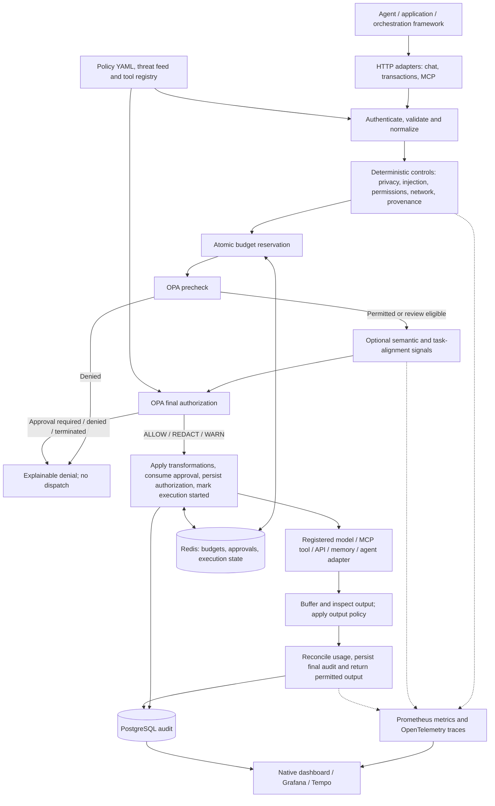

# 2 — Architecture

The gateway is the enforcement point for supported agent operations. Python adapters own resource metadata, provenance and effects; scanners and classifiers supply facts. OPA evaluates policy against those facts. Redis coordinates resource reservations, approvals and execution identities, while PostgreSQL persists audit events in deployment mode. Single-process demonstrations use in-memory stores.

## Architecture diagram



The editable diagram source is [architecture.mmd](architecture.mmd). The authoritative implementation is [pipeline.py](../5-implementation/app/core/pipeline.py); the common transaction contract is [transaction.py](../5-implementation/app/core/transaction.py). Budget admission precedes the OPA precheck, so denied attempts can consume step/rate counters conservatively. A deterministic denial avoids semantic inference during normal enforcement. Operator comparison mode may run both detectors to explain disagreements without executing an upstream.

## Performance: deterministic and non-deterministic enforcement

The following are **saved iteration 3 measurements**, carried forward unchanged during this repository reorganization. They describe the measured source identified in the reports, not a new benchmark of subsequent uncommitted detector changes. Detector timings exclude complete service/network/upstream latency. Do not interpret sequential detector processing rates as concurrent gateway capacity.

Warm local CPU comparison: identical 72 legacy test cases, two alternating passes (144 requests per detector), two CPU threads, tracing disabled, model already loaded.

| Path | p50 | p95 | p99 | Sequential processing rate |
|---|---:|---:|---:|---:|
| Deterministic rules | 0.526 ms | 0.979 ms | 1.244 ms | 1,781.82 cases/s |
| Real DeBERTa classifier | 147.888 ms | 209.857 ms | 226.585 ms | 6.60 cases/s |

Source: [paired-performance.json](../5-implementation/docs/iteration3/paired-performance.json). Model scores in the paired previous/current experiment were unchanged. These short-input timings do not describe long encoded or padded requests.

The broader suite measures all 4,102 cases across development, calibration and test partitions:

| Path | p50 | p95 | p99 | Sequential processing rate |
|---|---:|---:|---:|---:|
| Deterministic rules | 0.580 ms | 10.498 ms | 20.632 ms | 517.86 cases/s |
| Real DeBERTa classifier | 175.214 ms | 2,051.305 ms | 2,443.700 ms | 2.59 cases/s |
| Hybrid detector evaluation | 175.888 ms | 2,062.116 ms | 2,467.216 ms | 2.58 cases/s |

Source: `combined_v3.performance` in [measurements.json](../5-implementation/docs/iteration3/measurements.json). Hybrid evaluation combines detector work; normal enforcement can short-circuit. Other local services and a candidate-model experiment overlapped bulk evaluation, limiting timing attribution. The recorded v2 DeBERTa load time was 5.02 seconds and process RSS about 1,198.4 MiB; that RSS is a snapshot, not a peak quota.

Detection-quality evidence is separate from latency. On the saved v2 regression test:

| Detector | F1 | Recall | False-positive rate |
|---|---:|---:|---:|
| AI | 0.6969 | 53.94% | 1.60% |
| Rules | 0.7101 | 55.99% | 3.21% |
| Hybrid | 0.8343 | 73.29% | 4.49% |

The saved report retains three failed v2 quality gates and four additional combined-suite gates. Rules have bounded language/action coverage; AI scores are risk signals rather than calibrated probabilities. Passing implementation tests does not establish that detection targets have been met. Read the [complete measured report](../5-implementation/docs/DETECTION-ITERATION3.md) for cohort counts, source fingerprints and known misses.

## Reproduce measurements

Run from `5-implementation`, using an environment installed there and the pinned DeBERTa model:

```text
python scripts/paired_detection_performance.py
python scripts/robustness_eval.py --corpus v3 --output artifacts/submission-v3.json --name submission-v3
python scripts/benchmark_suite.py --mode fast
python scripts/benchmark_suite.py --mode semantic
python scripts/benchmark_suite.py --mode concurrency
```

The last three commands measure gateway paths under their respective protocols; inspect their report fields before comparing them with detector-only results. Runtime histograms separately expose deterministic, semantic, OPA, stage and total request latency; see [metric inventory](../3-reporting/METRICS.md).
