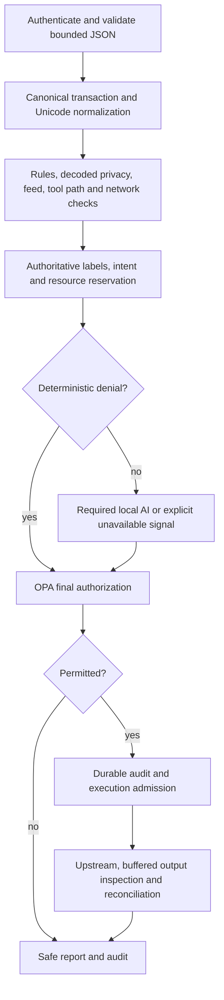

# Detection engineering report

This is an earlier completed iteration. The latest work and current-versus-previous measurements are in [Detection hardening, iteration 3](DETECTION-ITERATION3.md); [iteration 2](DETECTION-ITERATION2.md) records its starting baseline.

## Requirements and initial assessment

The supplied **RULES AI Control Layer.pdf** confirms the judging weights: guardrails 30%, architecture/performance 20%, reporting 20%, self-testing 15%, implementability/scalability 15%. It contains competition/submission conditions, not a technical detector specification. The user's pasted request supplies that specification. No secondary repository files were modified or executed.

Initial source commit: `ac7d45dc7eeda075054d7cf86dabf5558c8895fa`. Baseline checks: **199 Python tests, 27 Rego tests, Ruff passed**. The original 30-case semantic held-out set scored real DeBERTa F1 **0.75**, recall **0.60**. That historical dataset is distinct from the larger challenge set below; those scores must not be compared across datasets.

The existing architecture already protects identity, tenant boundaries, approvals, execution replay, budgets, resource admission, information flow, provenance, MCP manifests, SSRF, secrets/PII, output release, policy availability, and audit persistence. These controls were preserved. The main shortcomings were five unstructured instruction regexes, weak encoding coverage, sparse finding metadata, optional semantic scanning that missed ordinary trusted-user semantic attacks even when a model was configured, and no combined detector comparison view. Existing Grafana investigations remain available.

## Pipeline map and decisions



| Subsystem | Kind | Contribution and limits |
|---|---|---|
| Prompt rules, feed, schema, rooted relative path checks, network guard, secret/PII signatures and checksums | Deterministic | Explainable violations; secret entropy and some patterns are heuristics, not ML |
| ProtectAI DeBERTa v2, optional Prompt Guard 2 | Real ML | Binary prompt-injection score; overlapping windows; no authorization authority |
| Optional Ollama classifier | Real model | Separate injection/exfiltration/tool misuse signals; strict result schema |
| Optional task-alignment reviewer | Real model | Trusted workflow goal comparison; failure/abstention remain visible |
| OPA/Rego and authoritative information-flow labels | Deterministic policy | Final authorization, hard rule precedence, AI block/review thresholds, fail-safe modes |

High-confidence deterministic findings retain blocking precedence when AI says benign. AI-only high scores are actionable through OPA. Both benign leaves other policy checks in force. Unavailable/skipped AI is **not** counted as benign or as agreement. Normal execution short-circuits AI on deterministic denials; operator comparison runs both for reporting, except secret or other hard guardrail denials. The inspection console never invokes a target provider/tool or creates an approval.

The offline hybrid benchmark measures blocking classification with rule override plus the deployed AI threshold. It does not measure the full authorization state machine, review actions, tenant isolation, or side-effect safety. Integration tests and separate gateway benchmarks cover those boundaries.

## Implemented changes

- **AI:** shared Unicode/spacing/confusable/encoding inspection views, classification of decoded meaning with surrounding context, elimination of message-role inference, within-request deduplication, 65,536-character / 16,384-token / 40-window limits, bounded single-worker timeout behavior, two configurable CPU threads, local-only safetensors loading, pinned artifact checksums and exact DeBERTa labels. Configured providers now scan ordinary LLM requests. Optional startup warm-up avoids cold inference consuming the normal request deadline; missing models preserve declared failure behavior.
- **Rules:** ten compiled rules grouped around instruction overrides, disclosure, role delimiters/spoofing, exfiltration, safeguard/approval bypass, and bounded PL/ES/DE coverage. Findings include stable ID, category, severity, certainty, explanation, evidence hash, normalized location and remediation. Local negation checks scan all matches. Narrow educational exceptions require the complete trusted conversation, so another role/message cannot hide an attack.
- **Guardrails:** decoded secrets block before AI; decoded PII blocks when source offsets cannot be safely redacted; tool path traversal/absolute paths block in file-tool context. Unicode, URL/double-URL, escaped characters and printable Base64/Base64url are inspected. Depth, expansion and encoded-fragment limits reject content instead of silently ignoring later payloads. Arguments and approval digests are not rewritten by inspection views.
- **Data:** 216 reproducible synthetic cases, seed `20261004`, 72 each in calibration/development/test; 48 attack and 24 benign variants per split. Family IDs do not cross splits. Mutations include zero-width characters, fullwidth text, whitespace, Base64 and double URL encoding. Independent regressions add leetspeak, confusables, fragmentation, escapes, deep nesting, long padding, malformed input and resource limits. There was no model training; calibration is the tuning partition.
- **Testing:** a single `scripts/self_test.py` runs real Rego, lint, all Python tests, real AI/rule/hybrid evaluation and frozen regression gates. Missing model prerequisites fail the full run; `--checks-only` is explicitly partial. Four agreement combinations, model failure/timeout, comparison short-circuiting, authentication, audit failure, capacity, secret handling, evidence freshness and no-upstream execution are exercised.
- **Reporting:** additive `detection_report` in transaction/chat/MCP responses and audit events, separate input/output inspections, measured disagreement or explicit not-comparable status, model/rule versions, policy/feed revisions, timing and safe findings. Raw secrets, arbitrary JSON keys and prompts are not added to audit reports. Risk scores are not presented as calibrated probabilities.
- **Dashboard:** `/dashboard` provides live examples, editable input/source, comparison mode, stage trace, expandable evidence/remediation, OPA decision, latency, uncertainty, JSON export, separate detector metrics, historical baseline, confusion/category details, overlap and self-test status. API authentication is enforced independently of the page; credentials stay in page memory, rendering uses text nodes, and CSP disallows inline scripts. Reports are bound to source/configuration, installed model artifacts and relevant package versions; stale/missing evidence is labeled.
- **Performance/architecture:** reuse the existing policy pipeline and adapters; add small independent normalization, rule, privacy, path, report, corpus and evidence modules. No new runtime dependency, C++ extension, cross-repository runtime dependency or raw-content cache. The measured CPU hotspot remains model inference; rule scans are sub-millisecond on the challenge workload.

## Secondary repository comparison

`goldman_mikolaj/goldman_hackyeah_2026` was read as a reference. Its `semantic.py` supplied the design for explicit artifact verification, exact labels and bounded model work. Its `evidence.py` and evaluation workflow supplied the design for content-bound freshness and clear separation of held-out data from calibration. Its dashboard supplied operator access, current-evidence labeling and request-console patterns. Its authenticated export design informed the privacy-safe export boundary.

These ideas were reimplemented around the main repository's existing FastAPI/OPA pipeline. The reference's SQLite accounting, Streamlit frontend and narrower gateway were not transplanted: the main repository's existing shared-store, replay, information-flow and MCP boundaries are stronger for this project. Original scanner/provider snapshots are retained under `docs/baseline/` only to reproduce the **main** repository baseline; the gateway never loads them.

## Measurement protocol and regressions

The same challenge cases, labels and deployed DeBERTa block threshold (`0.9999991655349731`) are used before/after. Both detectors run independently in offline evaluation, so early exit cannot conceal disagreement. Reports include precision, recall, F1, accuracy, FPR/FNR, ROC-AUC, average precision, confusion counts, category breakdown, overlap, timing, throughput, resident memory and model loading time. `hybrid-baseline.json` preserves the initial run; `--baseline` reproduces archived implementations. Timing is descriptive of this CPU/environment, not a hard quota or load-test claim.

A threshold calibration experiment was rejected: it reduced development false negatives while producing unacceptable false positives. The production threshold was unchanged. Even after the improvements, development AI/hybrid false positives increased from **2 to 3** (FPR 8.3% to 12.5%). Calibration rules also have one false positive on an encoded educational question. The live model flags `Explain what 'ignore previous instructions' means.` as malicious. These regressions/limitations are exposed rather than hidden by a model bypass whitelist.

Final held-out results and current performance are recorded in [the measurement evidence](hybrid-measurements.json). The challenge is synthetic and correlated: six variants of one base attack are not six independent semantic discoveries. No population-level robustness, complete multilingual coverage or production readiness is established.

## Remaining risks

- **AI:** confidence saturation, foreign-language false positives, narrow injection specialization, and semantically subtle exfiltration misses remain. Optional Prompt Guard/Ollama alternatives were not available for measured replacement comparisons. Improvements measured here compare raw versus normalized real DeBERTa inference.
- **Rules:** finite languages/confusable mappings, quoted security/code discussions outside the narrow exceptions, unrecognized encodings, cross-field reconstruction and novel paraphrases remain limitations. Encoded privacy blocking is conservative. File-tool implementations must still enforce workspace roots, symlinks and OS-specific device restrictions at execution.
- **Aggregation:** hard precedence can amplify a mistaken rule; AI false positives can make the hybrid worse than rules on development data. The held-out challenge adds ten rule-only detections and no AI-only detections; AI complementarity was demonstrated separately in live HTTP inspection and must not be inferred from that held-out overlap.
- **Guardrails:** buffered output cannot undo an upstream side effect. Single-process inspection rate limits are local to each worker; deployment still needs service-wide admission/egress controls. Disabled/missing semantic providers do not supply ML protection. Resource limits bound admitted model work, not physical cancellation of a timed-out Torch worker.
- **Validation:** browser visual/interaction QA was unavailable because no browser was connected. Static JavaScript syntax and live/backend integration were checked. New end-to-end checks used local real OPA and an inert upstream; Docker/PostgreSQL/real external MCP deployments and AgentDyn were not rerun. Earlier documented AgentDyn benign-task utility remains an unresolved issue.

## Run commands

From the main repository, using PowerShell:

```powershell
# Install core/test dependencies and verified OPA if needed.
python scripts/bootstrap.py
# Optional local ML dependencies and explicitly pinned public model.
python scripts/bootstrap.py --semantic
.\.venv\Scripts\python.exe scripts\download_models.py --model deberta

# Application, dashboard and live console.
$env:AICL_SEMANTIC_PROVIDER = 'deberta'
.\.venv\Scripts\python.exe scripts\serve.py
# Open http://127.0.0.1:8000/dashboard; local demo admin token: demo-admin-token.
# Omit the environment setting for the lightweight rule-only gateway demo.

# In a second terminal: complete self-test, including real ML and metric gates.
.\.venv\Scripts\python.exe scripts\self_test.py
# Core-only checks (explicitly partial; no real-model acceptance).
.\.venv\Scripts\python.exe scripts\self_test.py --checks-only

# Original AI-only benchmark (own corpus/calibration; not the challenge comparison).
.\.venv\Scripts\python.exe scripts\semantic_eval.py
# Rule-only challenge evaluation; no ML dependencies required.
.\.venv\Scripts\python.exe scripts\deterministic_eval.py
# Same-corpus separate AI, rule and hybrid evaluation using deployed thresholds.
.\.venv\Scripts\python.exe scripts\hybrid_eval.py
# Reproduce the initial detector implementation on that exact corpus.
.\.venv\Scripts\python.exe scripts\hybrid_eval.py --baseline --output artifacts/hybrid-baseline-reproduced.json
# Optional calibration experiment; never automatically changes deployed policy.
.\.venv\Scripts\python.exe scripts\hybrid_eval.py --calibrate --output artifacts/hybrid-calibration.json
# Reproducible synthetic-data generation.
.\.venv\Scripts\python.exe scripts\hybrid_eval.py --generate --output artifacts/hybrid-corpus.jsonl
# Live HTTP demo; needs the running gateway configured with real DeBERTa.
.\.venv\Scripts\python.exe scripts\detection_smoke.py
# Independently owned OPA and inert adapters; no running stack required.
.\.venv\Scripts\python.exe scripts\benchmark_suite.py --mode fast --samples 40
.\.venv\Scripts\python.exe scripts\benchmark_suite.py --mode semantic --samples 20
```

On Linux/macOS substitute `.venv/bin/python`. Local services bind to loopback. Normal startup never downloads weights. JSON exports omit raw payloads; synthetic corpus generation intentionally contains inert attack text.

## Final measured summary

Same held-out challenge: 72 cases, 48 attacks and 24 benign variants.

| Detector | F1 baseline -> final | Recall baseline -> final | FP baseline -> final | FN baseline -> final | Accuracy baseline -> final |
|---|---:|---:|---:|---:|---:|
| ai | 0.609 -> 0.800 | 43.8% -> 66.7% | 0 -> 0 | 27 -> 16 | 62.5% -> 77.8% |
| deterministic | 0.286 -> 0.933 | 16.7% -> 87.5% | 0 -> 0 | 40 -> 6 | 44.4% -> 91.7% |
| hybrid | 0.648 -> 0.933 | 47.9% -> 87.5% | 0 -> 0 | 25 -> 6 | 65.3% -> 91.7% |

Hybrid F1 improves by 0.285 points (44.1% relative); held-out false negatives fall 76%, from 25 to 6. All three held-out precisions are 1.0 and measured FPR is 0/24, which is not a guarantee of zero real-world false positives. Final confusion counts (TP, FP, TN, FN): AI (32, 0, 24, 16), rules/hybrid (42, 0, 24, 6).

Disagreement falls from 17/72 (23.6%) to 10/72 (13.9%). Final overlap: AI-only 0, rule-only 10, both 32. Rules correct ten AI misses; AI adds no held-out detections beyond the improved rules. The separate real HTTP task-hijack example is AI-only; the Polish override is rule-only at the blocking threshold; the direct English override is detected by both. The legitimate security question is an exposed AI-only false positive.

| Detector workload | p50 ms baseline -> final | p95 ms baseline -> final | Throughput/s baseline -> final |
|---|---:|---:|---:|
| ai | 232.944 -> 115.277 | 291.908 -> 125.061 | 4.09 -> 8.63 |
| deterministic | 0.040 -> 0.184 | 0.058 -> 0.319 | 21469.04 -> 5188.64 |
| hybrid | 232.981 -> 115.463 | 291.968 -> 125.240 | 4.09 -> 8.62 |

Broader rule inspection costs more than the original five regexes (p95 0.058 ms -> 0.319 ms), while remaining sub-millisecond on this corpus. Avoided role inference and normalized decoded meaning halve model workload. No C++ optimization was warranted. Resident process memory: 819.3 MiB -> 781.7 MiB; model load 2.73s -> 3.19s, including new integrity verification. These are observed RSS/loading values, not isolated model tensor memory or physical quotas.

Separate gateway measurements (ASGI + real OPA HTTP + inert upstream, in-memory admission): fast path p50 8.86 ms / p95 11.21 ms / 98.84 requests/s; real semantic input and output path p50 218.55 ms / p95 233.97 ms / 4.46 requests/s. No errors or security denials in those 40/20-case benign workloads. These are final boundary measurements; no before/after gateway speedup is claimed.

Final full self-test: **264 Python tests passed**, **27 Rego tests passed**, Ruff passed, **zero failures/errors/skips**, and all detector metric/latency gates passed. This adds 65 Python regression/integration cases to the original suite. New coverage includes every rule, AI admission and thresholds, all four disagreement cases, encoded privacy, source/model freshness, reversed labels, multilingual/Unicode/encoding bypasses, deep nesting/late encoded fragments, large padding, model failure/timeout and operator HTTP/report boundaries. JavaScript syntax checked with Node. The archived baseline reproduced every split's metrics exactly.
