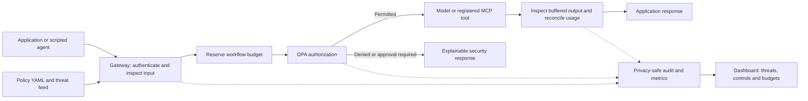

# Integrating the control layer

The gateway exposes buffered HTTP endpoints for supported chat requests, tool/MCP calls, agent messages, memory and network operations. Point the application's model and tool calls at the gateway rather than directly at an upstream. This is a supported protocol subset: arbitrary OpenAI streaming, all MCP transports and every provider API are not implemented.

The small async client is `app.client.ControlClient`. It uses the application's identity, returns the security decision, never retries mutations and requires permitted output before application code can consume a response.

```python
import asyncio
from app.client import ControlClient, tool_request

async def main():
    async with ControlClient("http://127.0.0.1:8010", "demo-user-token") as gateway:
        result = await gateway.chat("Give a public checkout status summary", workflow_id="checkout-1")
        print(result.decision, result.security.get("reason_codes"))
        answer = result.require_output()["content"]
        print(answer)

        request = tool_request("github.search", {"query": "checkout"}, "checkout-1")
        output = (await gateway.transaction(request)).require_output()
        print(output["result"])

asyncio.run(main())
```

Run from an editable installation (`python -m pip install -e '.[test,semantic]'`). For a provider-backed chat use `model="qwen3:4b", provider="ollama"` only when that upstream is installed, configured and allowed by policy. The showcase's `mock/demo` is an inert deterministic summarizer, with synthetic token usage; it does not establish autonomous model utility.

Mutations should carry an `execution_id`, retained across retries of the exact operation, and an explicit workflow ID. Do not manufacture a new execution ID to work around an uncertain execution. Only the operator may resolve uncertain outcomes. A permission decision is not an instruction to retry the upstream directly.

If the decision is `REQUIRE_APPROVAL`, stop and present the exact operation to the operator. An independent operator client can call `issue_approval(request, subject=..., tenant_id=..., agent_id=...)`. Resubmit the exact request with the returned `approval_token`. Approval binds identity, arguments, workflow, policy revision, manifest and execution ID; it cannot authorize a changed operation. Keep the operator credential outside the agent in deployed systems. The isolated judge script intentionally simulates both actors.

The gateway authenticates identity and owns effect, trust, risk and budget facts. Callers cannot send a principal or elevate source trust. Include policy configuration, shared Redis/PostgreSQL stores, real authentication and audited upstream credentials when moving beyond demo mode. The local demo tokens and in-memory stores are demonstration configuration.


