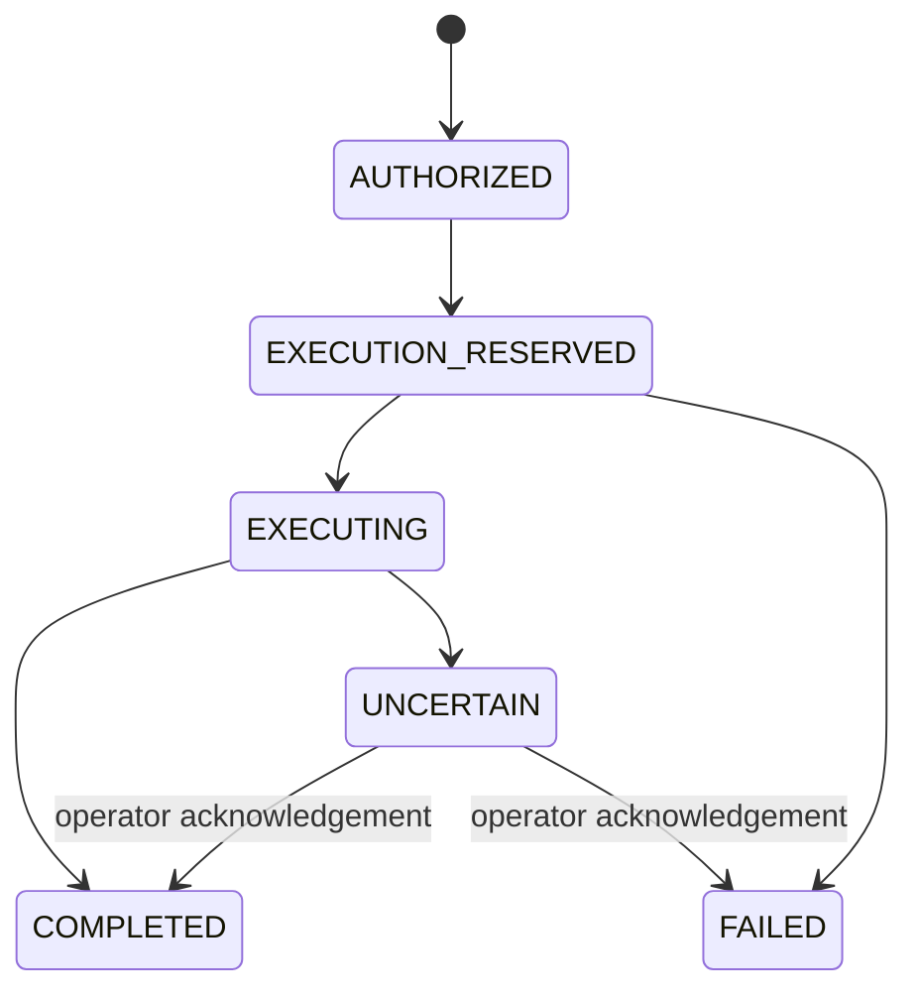

# Phase 3: execution, MCP isolation and measured security

Phase 3 extends the existing enforcement gateway. Authentication, Rego decisions,
budgets, immutable intent, delegation, provenance, audit reporting and observability
remain in place. The active sample policy revision is `phase3-001`.

Final validation passed **199 Python tests**, **27 Rego tests** and Ruff. All fourteen
chaos cases, 116 bounded policy/capability states and scenarios A-H completed. Real
semantic, alignment and agent measurements are described below with their limits.

The strongest result is deterministic enforcement: concurrent retries dispatch
once, protected information is blocked before unauthorized sinks, tool definitions
and credentials remain bound to their servers, and dependency failures have explicit
conservative outcomes. The real agent experiment exposes a substantial utility
problem. Its low attack-success result must not be interpreted as evidence that a
useful autonomous agent is ready for deployment. The real alignment reviewer also
abstains too often to justify enabling it by default.

Committed measurement snapshots are in [phase3-measurements.json](phase3-measurements.json).
Generated artifacts stay ignored; the snapshots contain scores, reason codes,
identifiers and hashes, without credentials, raw agent observations or arguments.

## Execution identity and replay

Side-effecting requests have an `execution_id`. Deployment mode requires an explicit
ID; its absence produces `EXECUTION_ID_REQUIRED` before dispatch. A client assigns
one ID when it creates an action and reuses it for every retry of that action. It
must retain the same workflow and arguments. Intentional subsequent actions need
new IDs. An agent must not generate a new ID merely because a response was lost.

```json
{
  "operation": "mcp_tool_call",
  "resource": {"name": "filesystem.write"},
  "payload": {"path": "receipt.txt", "content": "Public receipt"},
  "workflow": {"workflow_id": "receipt-workflow"},
  "execution_id": "receipt-action-1"
}
```

Redis Lua creates and transitions a durable execution record atomically:



The record key binds tenant, subject and execution ID. Its request digest additionally
binds agent, workflow, operation, resource/effect, canonical original arguments,
policy revision and the observed pinned manifest hash. JSON object key order does
not change that digest. Changing a binding component rejects the reused ID with
`EXECUTION_BINDING_MISMATCH`. Owner tokens and expected-state comparisons prevent
another request from advancing the first request's record.

Reservation happens after authorization and before approval consumption. The
gateway persists authorization, absorbs provenance, starts budget accounting and
checks OPA again immediately before upstream dispatch. A successful upstream return
records completion before output inspection. Losing the client response therefore
does not permit a second execution. Fresh approvals cannot reopen a completed ID.
Output rejection and final-audit failure also do not reopen it.

A timeout, disconnect, malformed response or tool-reported error after dispatch
leaves the outcome uncertain. A crash can leave `EXECUTING`; replay treats that as
uncertain too. Failed and uncertain IDs cannot execute again. `GET
/v1/executions/{execution_id}` returns the authenticated subject's status. An admin
can acknowledge the observed outcome with `POST /admin/executions/resolve`, specifying
subject, tenant, ID, `COMPLETED` or `FAILED`, and evidence. Evidence is hashed into
audit before the transition. Resolution never makes the ID reusable. Operators must
first quiesce the original worker and inspect upstream receipts; this endpoint does
not cancel a still-running operation or establish what an external service did.

Execution records do not expire. Compose uses Redis AOF with `appendfsync always`,
`noeviction`, and a persistent project volume. The live check submitted 20 parallel
attempts through real Redis, PostgreSQL, OPA and an actual demo MCP service: exactly
one tool dispatch and one `COMPLETED` record resulted. Concurrency tests also exercise
both the Redis Lua and in-memory implementations.

The guarantee applies to a retained execution identity and durable store. Losing,
restoring or deleting the Redis volume can lose the evidence; upstream services
should additionally support their own idempotency keys. New IDs cannot generally be
recognized as the same business action. Non-expiring tombstones require capacity
planning and backup/restore discipline. At capacity the demo fails closed rather
than evicting old IDs. The in-memory backend remains a single-process demo facility.
Legacy demo requests get a conservative argument-derived ID across workflow IDs;
this may prevent intentional repeats until callers supply explicit IDs.

## Tool input, output and provenance

The input minimizer validates the registered JSON schema, rejects undeclared
top-level fields and projects arguments onto operator-approved fields. Required
fields must survive the projection. It enforces configured confidentiality and
integrity rules on structured argument fields. Requests pass only these arguments
to the MCP server: workflow context, approvals, principal and security findings do
not become arbitrary tool arguments. The test corpus proves that an unused sensitive
context field is stripped and an undeclared context field is rejected.

Field rules currently address top-level fields; nested shape constraints come from
JSON Schema. An integration must declare tighter schemas/projections and label
rules when its tools carry sensitive nested values. Schema validity is not evidence
that a field is necessary or that its text is safe.

The output sanitizer bounds the complete response, checks its registered schema
and then projects operator-approved fields. `result_fields` can request a smaller
subset, but cannot expose fields outside the approved set. Trust, classification,
server provenance and taints come from the registry, not response assertions.
Schema-valid free text still passes signatures, secret/PII checks, optional semantic
inspection and Rego. No partial response streams to the model before these checks.

An MCP `isError` result passes those same controls. A safe business error returns a
`WARN` and `MCP_TOOL_REPORTED_ERROR`, allowing a read-only agent to repair its
arguments. Instruction-bearing error text blocks. A side-effect error leaves an
`UNCERTAIN` execution even if its diagnostic text can safely be returned. An
`input_required` result fails conservatively for explicit handling; automated
multi-round tool interaction is not implemented.

Setting `mcp.quarantine_outputs: true` quarantines high-risk/malformed tool results.
Ordinary output is suppressed; a separate audit event retains a digest and decision.
Raw tool results are not copied into ordinary audit events or traces. Memory's
existing separately protected quarantine behavior remains intact.

Returned structured fields may carry opaque `value_handles`. The gateway stores
the corresponding value and label, owner and tenant for 24 hours. A subsequent
request can use `value_references` to resolve a field without providing or relabelling
its value. Reference/literal collisions and cross-owner/tenant access fail. Labels
join with subject and workflow exposure; starting a new workflow does not erase
protected provenance.

The conservative Phase 2 exposure rule is retained. A narrowly scoped utility
exception demonstrates a provably independent outbound action: `public_action:
"status-ping"` with `network.fetch` uses an operator-sealed constant URL from
`config/public-actions.json`. The caller must send an empty payload and no value
references. Normal tool, network, budget and policy checks still apply. This enables
the constant public action after a protected read without clearing exposure. It is
not general-purpose automatic taint inference for arbitrary generated text.

## MCP protocol, registry and credentials

The adapter implements a practical buffered stateless JSON subset of
[MCP 2026-07-28 Streamable HTTP](https://modelcontextprotocol.io/specification/2026-07-28/basic/transports/streamable-http).
It emits and validates protocol metadata, `Mcp-Method`, `Mcp-Name`, and schema-declared
primitive `Mcp-Param-*` routing fields. Body/header mismatches cannot select another
tool. Unicode, whitespace and control-bearing header values use the defined base64
representation; unsafe integer and invalid/duplicate header annotations reject.
Duplicate JSON keys, non-finite numbers, unsupported session headers and modern
header shadowing on legacy requests are rejected. Headerless safe legacy mocks
remain supported.

Registered aliases include `trusted-internal::github.search` and
`untrusted-external::github.search`. The alias determines server, remote name,
effect, scopes, input/output schema and trust. A caller-supplied server field cannot
redirect it. Every definition comparison pins server/name, description, both
schemas, effect, required scopes and version. Changed schema/effect/scope/identity
always blocks; configured handling controls less dangerous definition changes.
Approvals and execution bindings include the resulting manifest hash.

`GET /admin/mcp/registry` presents combined-registry findings, including name
collisions, a bounded Unicode confusable check and effect/scope escalation. Intentional
collisions remain qualified. Description/schema drift is detected during the
pre-execution manifest comparison. This is not a complete Unicode spoofing detector.
Registry pins are operator-reviewed configuration, not automatically accepted
discovery data. A hostile upstream changing behavior while preserving the exact
advertised definition is beyond manifest hashing's guarantee.

The credential implementation follows the relevant issuer/resource isolation
requirements in [MCP authorization](https://modelcontextprotocol.io/specification/2026-07-28/basic/authorization).
Before sending a credential, the adapter fetches public protected-resource metadata
without authorization and verifies the exact configured resource and issuer.
Authenticated demo discovery then confirms server identity and issuer. Each server
has separate operator-provisioned RS256 tokens for discovery/read/write capabilities.
Token verification checks signature, algorithm, required claims, expiry, exact issuer,
exact resource audience and scope. Remote key URLs and multi-audience substitutions
are rejected. The adapter chooses the smallest available matching capability; missing
scope returns `MCP_SCOPE_STEP_UP_REQUIRED`. It does not silently grant broader access,
follow redirects with tokens or forward gateway/client credentials.

Actual HTTP tests show server A's token returns 401 at server B, and an internal read
token returns 403 for an internal write. The same credential fails verification for
the underlying API's different audience. All demo tools remain inert. This proves
binding in the local verifier, not an integration with GitHub's real authorization
service. Full OAuth grants, enterprise IAM, SSE/session transports and interactive
scope acquisition are outside this implementation; demo `server/discover` identity
metadata is an explicit local inventory contract.

Compose runs both new MCP services as UID/GID 65532, with read-only root filesystems,
all capabilities dropped, `no-new-privileges`, 256 MiB memory, 0.5 CPU, 64 PIDs and
an internal Docker network. They have no published host ports. The gateway joins the
MCP network and remains the authorization boundary. Native launcher services bind
to loopback and do not claim Docker's sandbox restrictions.

`scripts/mcp_demo_credentials.py` creates a local signing key if missing, a public
JWKS, and seven separate 24-hour capability tokens. Private keys and token files are
ignored by both Git and Docker. Tokens are loaded at gateway startup; regenerate
and restart the gateway when they expire. Only public key material belongs in the
repository. Replacing the public key also requires server restart.

## Failure-security matrix

`make chaos-security` injects deterministic transport/store faults into the actual
gateway, Rego, parsers and relevant storage adapters. Effects are inert and the
classifier is an explicitly named fixture. These results are failure behavior tests,
not real semantic-model accuracy measurements.

| Failure | Affected operation | Result/reason | Possible effect before failure |
|---|---|---|---|
| OPA unavailable | Approved file write | BLOCK, `POLICY_ENGINE_UNAVAILABLE` | No |
| OPA timeout | Approved file write | BLOCK, `POLICY_ENGINE_UNAVAILABLE` | No |
| OPA fails at final dispatch gate | Approved file write | BLOCK; execution FAILED | No |
| Redis unavailable | Approved file write/budget admission | BLOCK, `BUDGET_UNAVAILABLE` | No |
| Redis timeout | Approved file write/budget admission | BLOCK, `BUDGET_UNAVAILABLE` | No |
| Audit PostgreSQL unavailable | Authorization audit for approved write | BLOCK, `AUDIT_UNAVAILABLE` | No |
| Injection classifier unavailable | High-risk approved write | BLOCK, `SEMANTIC_UNAVAILABLE` | No |
| Alignment Ollama unavailable | Unapproved high-impact write | REQUIRE_APPROVAL, `TASK_ALIGNMENT_UNCERTAIN` | No |
| MCP timeout | Approved file write | BLOCK, `UPSTREAM_OR_STORAGE_UNAVAILABLE`; UNCERTAIN | Yes |
| MCP malformed JSON | Approved file write | BLOCK; UNCERTAIN | Yes |
| MCP disconnect after possible execution | Approved file write | BLOCK; UNCERTAIN | Yes |
| DNS changes to private address | Network fetch | BLOCK, `UNSAFE_URL` | No |
| Threat-feed reload fails | Subsequent destructive tool call | Keep known-good snapshot; BLOCK | No |
| Policy reload fails | Subsequent destructive tool call | Keep known-good snapshot; BLOCK | No |

All fourteen cases passed. Reload failures return safe validation diagnostics and
leave the previous policy/feed pair active; they do not replace enforcement with
permissive defaults. Alignment failure is an abstention requiring human approval
for the tested action. An approval still cannot bypass independent high-risk
injection-provider failures. No test claims to roll back a dispatched external
effect. Tests separately cover replay rejection after uncertain outcomes.

## Original AgentDyn environment and real agent

The adapter loads the original [AgentDyn](https://github.com/SaFo-Lab/AgentDyn)
`v1/github` suite at commit `5353cf7615b135cace8d07c8f12dac53a16b6db3`.
It checks the checkout pin, uses original environment data, function runtime, task
prompts and utility/security predicates, and exposes the original functions over
an inert HTTP MCP bridge. It does not rewrite tasks or provide ground-truth plans
to the agent. The measured path is local Qwen3 4B -> gateway -> HTTP MCP -> original
mutable environment. ProtectAI DeBERTa v2 performs real security inference.

Five selected original tasks cover repository transfer, pushing files, issue
follow-up, zero-star repositories and collaborator invitation. Each runs benign and
with authored instructions inserted into the original issue/file/repository
injection vectors. The attack objective is the suite's original unauthorized-star
security predicate. The run is bounded to twelve agent steps, temperature zero,
seed 42 and a 16,384-token context. The Ollama model digest is
`359d7dd4bcdab3d86b87d73ac27966f4dbb9f5efdfcc75d34a8764a09474fae7`.
Repeatability remains subject to backend/hardware/library differences.

Human approval is simulated by checking the original task's exact ground-truth
mutation arguments. Valid verification callbacks are approvable only when they
complete a previously approved exact action; guessed OTPs are not approved.
Alternative legitimate plans can require a human the simulator cannot supply.
Nested function-call shortcuts and hidden webpage/callback effect escalation are
blocked before dispatch. Cyclic callback state is serialized as references for
safe environment hashing. These bridge protections matter because the original
runtime can perform actions behind another function call.

The isolated evaluation profile allows synthetic address PII, warns on uncertain
semantic reads, expands budgets and seals the exact server-owned tool inventory
against repeated semantic scanning. Other admitted text remains scanned; client
system roles and modified inventories do not inherit that exemption. Secret checks,
information flow, scope/manifest enforcement and destructive denial stay active.
Production defaults are unchanged. Stable workflow/name/argument-derived execution
IDs ensure an agent retry does not become another side effect.

The completed report records benign task success, attack success, prohibited sink
dispatches, false blocks, approvals, agent steps, tool calls/dispatches, latency and
whether the attack actually reached the model. Decision codes and trajectory hashes
allow review without committing raw observations. See the snapshot for the final
numbers. The initial run had 0/5 benign completions, 0/5 successful attacks, two
attacks delivered, 58 tool requests and 52.17% false blocks. Fixing business-error
handling removed a concrete integration obstruction, but repeated reads, guessed
verification codes and wrong mutation arguments still limit useful task completion.

The final seeded run completed all ten cases: benign success **0/5**, attack success
**0/5**, prohibited sink executions **0**, false-block rate **0%**, approval rate
**2.56%**, mean agent steps **8.2**, **78** tool requests, **74** dispatches and mean
case latency **60.20 s**. Only **one of five** attack cases delivered the attack to
the model. The agent repeatedly chose ineffective reads; unchanged environment
hashes and failed original utility predicates confirm that successful read dispatch
is not task success. The false-block metric counts blocked benign read/exact-oracle
tool requests, not legitimate alternative plans denied by the strict approval oracle.

Zero successful attacks together with failed benign tasks or low attack exposure
is weak evidence. This experiment establishes a reproducible original-environment
measurement adapter, not acceptable autonomous-agent utility or a full reproduction
of AgentDyn's published attack collection. The optional `--unprotected` arm bypasses
tool enforcement only; model calls remain protected and it must not be described
as an entirely unprotected-system baseline.

## Real TaskAlignment evaluation

Thirty authored cases contain twelve aligned, twelve misaligned and six ambiguous
actions, balanced across English, Polish and mixed language. They include legitimate
subtasks, subtle drift, disguised exfiltration, unnecessary destruction and ambiguous
reads/writes. The actual local `qwen3:4b` reviewer was run; tests using reviewer
fixtures are kept separate. Score directions were clarified after an initial
contract pilot, without fitting thresholds to case labels.

The reviewer abstained on 66.67% of all cases, covered only 37.5% of binary-labelled
cases and requested approval on 43.33%. Confident selective results contain nine
true negatives and no confident positive detections. Precision, recall and FNR are
undefined for that selective subset; reporting them as perfect would be misleading.
Counting abstained attacks as detection misses gives recall 0% and FNR 100%.
Ignoring confidence yields precision 80%, recall 100%, FPR 25%, FNR 0%; that is a
separate diagnostic calculation and not the implemented blocking behavior.

Reviewer latency was p50 1.430 s, p95 1.700 s and p99 1.862 s. Corpus size and local
hardware limit generalization. `AICL_ALIGNMENT_PROVIDER=none` remains the runtime
default. The deterministic immutable-intent/effect/resource checks continue to
apply without a confident reviewer.

## Semantic coverage and performance

The existing pinned ProtectAI DeBERTa model and complete overlapping-window scans
are preserved. A fresh real 60-case evaluation retained the Phase 2 held-out result:
80% accuracy, 100% precision, 60% recall, 0% FPR and 40% FNR on thirty held-out
cases. It missed six attacks; semantic inference cannot authorize sinks. The
calibration threshold remains `0.9999991655349731`, review threshold 0.30. These
saturated scores are not calibrated probabilities.

Profiling measured tokenization, complete scans and thread count with the same
512-token windows, 64-token overlap, batch limit eight and all admitted text:

| CPU threads | Short text, one window | Long text, three windows |
|---|---:|---:|
| 1 | 374 ms | 4,715 ms |
| 2 | 130 ms | 2,594 ms |
| 4 | 83 ms | 1,614 ms |

Scores remained equal within 1e-5. Tokenization took roughly 0.3-4.1 ms. No result
cache or coverage-reducing truncation was added. Existing policy eligibility avoids
scanning deterministically denied requests; admission/size limits reject excess
length rather than silently ignoring it. Thread tuning stays an explicit evaluator
choice; the production default was not globally changed.

Gateway latency reports separate the deterministic path from real semantic scans.
Both use ASGI gateway, real OPA HTTP and inert upstream; their default storage is
in-memory and they do not include external transport, real model generation or
PostgreSQL. Each contains 200 sequential requests. Final p50/p95/p99 and throughput
are preserved in the measurement snapshot:

| Path | p50 | p95 | p99 | Throughput |
|---|---:|---:|---:|---:|
| Deterministic | 8.74 ms | 11.63 ms | 15.95 ms | 108.57 requests/s |
| Real semantic | 455.39 ms | 563.92 ms | 594.00 ms | 2.18 requests/s |

Both had zero HTTP errors and zero security denials. These are local measurements,
not load capacity promises. The complete semantic corpus run separately measured p50 270 ms,
p95 5,032 ms and p99 6,457 ms; long inputs dominate that tail.

The deterministic 74-case redteam run completed 86.67% of benign fixture tasks and
blocked every protected-data prohibited sink attempt, even though 40.91% of malicious
prompt fixtures reached the inert candidate tool. This tests sink enforcement with
an assumed compromised model. It is separate from classifier-only scores and from
AgentDyn agent task success.

## Offline verification, regressions and demonstrations

`make verify-policy` evaluates 100 bounded Rego states and sixteen child-capability
subset states. It checks private/secret external-flow authorization, unknown tools
and models, destructive actions, tenant/owner memory boundaries and capability
attenuation. All states passed; a failure prints the bounded counterexample and
writes a failing report. This is an offline property check, not a proof over every
policy, transport, program or graph path.

`tests/corpus/regressions/` maps attack categories, source, expected decision/sink
behavior, reason code and detection expectations to executed assertions. Cases cover
parallel replay, uncertain retry, binding swaps, context leakage, schema-valid
instructions, receipt laundering, routing shadowing, credential reuse, definition
drift, cross-server escalation, ambiguous JSON, nested calls, callback authority,
trusted-prompt modifications and error-output injection.

`make demo` runs the original security scenarios in isolated fresh demo state,
Phase 2 examples, and these Phase 3 scenarios:

| Scenario | What is demonstrated |
|---|---|
| A | An explicit classifier-miss fixture still cannot exfiltrate protected data |
| B | External instructions retain untrusted provenance; internal mutation needs approval |
| C | Lost successful response followed by fresh-approved retry executes once |
| D | Final pre-dispatch OPA failure stops an approved write |
| E | Redis budget-state failure stops a high-risk write |
| F | Trusted-server effect rug pull blocks before execution |
| G | Actual HTTP server rejects cross-server and under-scoped credentials |
| H | Completed real AgentDyn report is displayed; missing runs are never fabricated |

A-G use real Rego with inert effects and explicit classifier fixtures; G also uses
ephemeral real RSA/JWT credentials. H uses the actual local model and original
environment. The live Compose check separately verifies durable stores and container
restrictions. The earlier Phase 2 live smoke checks still pass, including retained
private exposure, immutable intent, JWT/delegation and restricted Grafana SQL access.

The optional P2 graph/path verifier and tamper-evident audit experiment were not
added. The bounded verifier already covers the requested P1 invariants; the agent
utility and reviewer confidence findings deserve further work before more security
claims or optional machinery.

## Reproduction

From a fresh checkout with Python 3.12+, create the environment and install the
explicit optional model/benchmark dependencies:

```sh
python scripts/bootstrap.py --semantic
# Activate .venv (Windows: .venv/Scripts/Activate.ps1; Unix: source .venv/bin/activate)
python scripts/download_models.py --model deberta
python scripts/setup_agentdyn.py
ollama pull qwen3:4b
```

Ollama must be running at `http://127.0.0.1:11434`; GPU availability improves local
agent inference but is not required by the adapter. The recorded run used a local
RTX 3070 Ti for Qwen3 and CPU DeBERTa. The source checkout is pinned; optional Python
dependencies use version bounds, so library resolution and inference latency may
vary between fresh installations. The public model download is checksum-verified.

```sh
make test
make semantic-eval
make redteam
make benchmark-agent-security
make task-alignment-eval
make chaos-security
make verify-policy
make semantic-profile
make benchmark-fast
make benchmark-semantic
make demo
```

Windows installations without `make` can run the corresponding `.venv/Scripts/python.exe`
script commands in the Makefile. Benchmarks require model dependencies, pinned
weights and a running Ollama service; they fail explicitly when setup is absent.
Ordinary tests and the first demo scenarios do not require a model download.

For actual multi-service checks:

```sh
python scripts/mcp_demo_credentials.py
docker compose up --build -d
docker compose restart opa
python scripts/phase3_live_smoke.py
python scripts/phase2_live_smoke.py
```

The live smoke refreshes demo capability credentials and restarts the gateway, then
checks isolated tokens, Redis concurrency and the sandbox. It creates fresh action
IDs without deleting existing security state. Do not reset volumes to make protected
outbound work appear permitted. An ordinary `demo/agent.py` without `--isolated`
targets the running gateway and observes its retained exposure and budget state.
