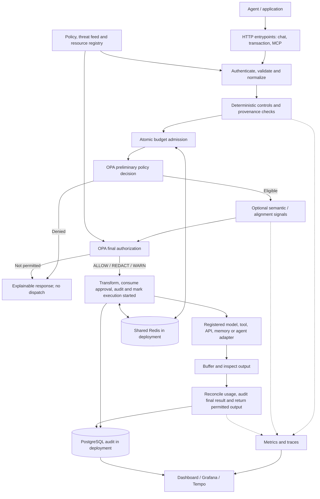
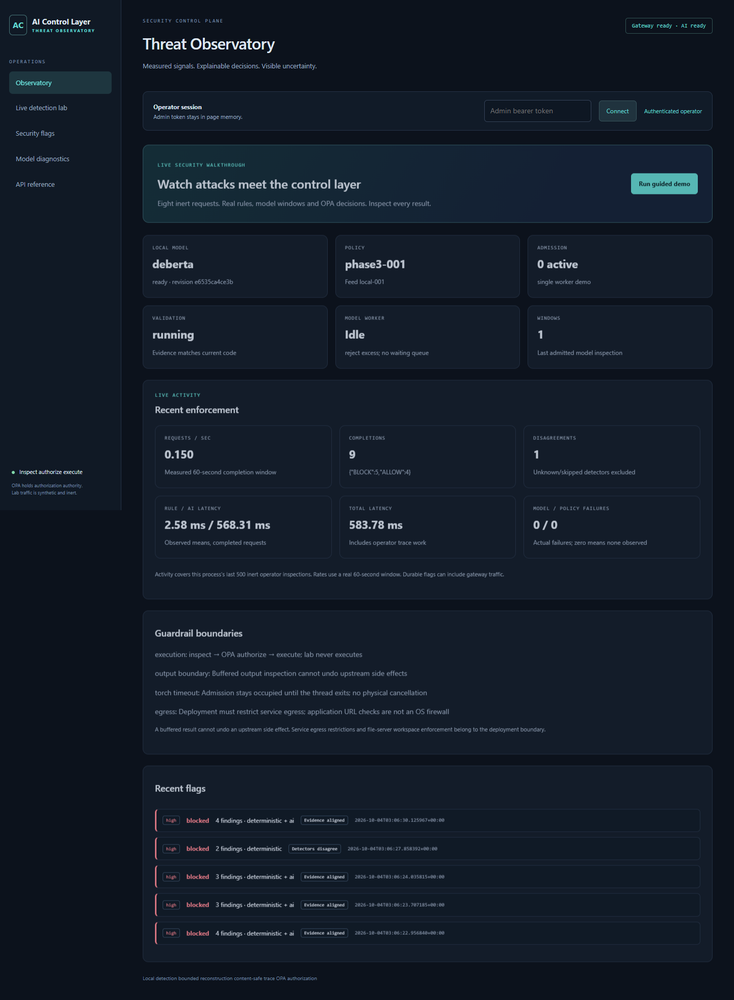
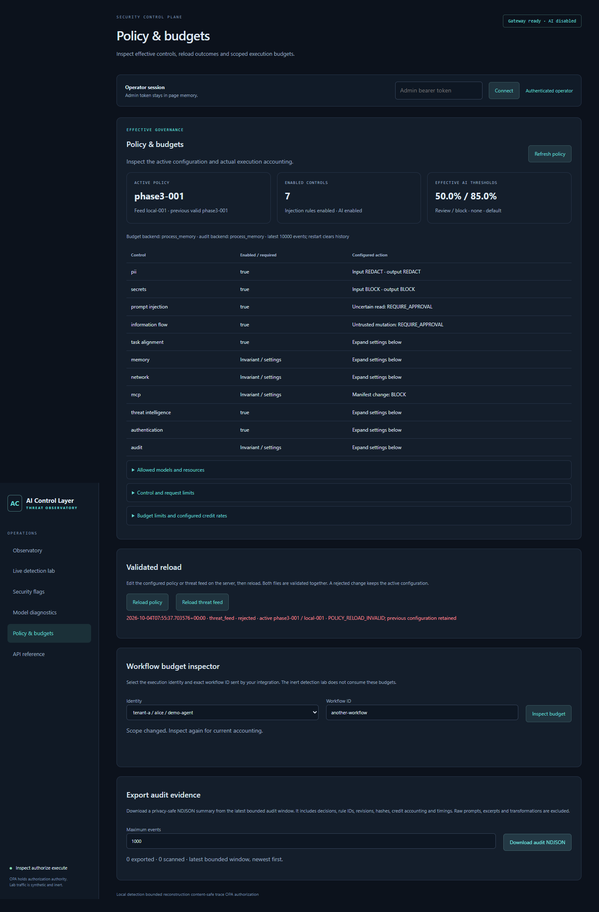
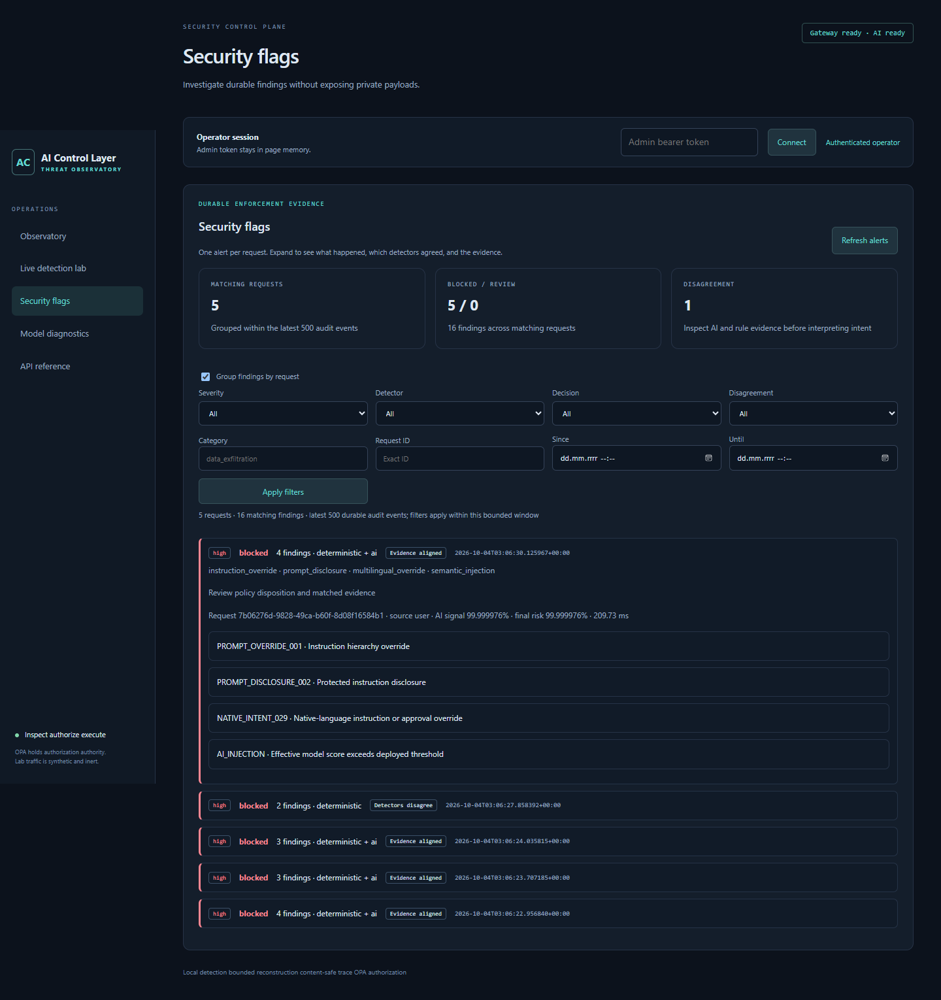

# AI Control Layer — complete project overview

This is a single reading guide to the work in this repository, organized around the five requested delivery sections: solution, architecture, reporting, testing and implementation. It explains what is implemented, how the controls are configured, what the evidence shows, and how the gateway can sit inside an existing agent application.

**Local dashboard:** [http://127.0.0.1:8012/dashboard](http://127.0.0.1:8012/dashboard). Use `demo-admin-token` in the operator connection field. The local preview was started and its readiness endpoint verified on 2026-10-04: the gateway reported `ready`, the semantic provider was `deberta`, the classifier state was `ready`, and the active policy was `judge-balanced-v1`.

The running preview uses real OPA and the pinned DeBERTa classifier, with an inert issue tracker and deterministic summarizer. Its accounting, memory and audit state are in process memory. Model classification is real; the demonstration's tools and chat summarizer are simulated. The saved performance tables below come from earlier recorded experiments and are not a new benchmark of this preview.

Two sample requests have already been sent through this live preview: a benign public-summary request returned HTTP 200 / `ALLOW`, and an instruction to override rules and reveal the hidden system prompt returned HTTP 403 / `BLOCK` with `PROMPT_INJECTION_PATTERN`. They provide initial execution/audit activity to inspect. Browser automation could not open the window because it could not reliably verify the current browser URL; use the dashboard link above to open it yourself.

| Requirement | Where it is covered in this document |
|---|---|
| Solution introduction, controls and policy configuration | Section 1 |
| Architecture diagram and deterministic/AI performance | Section 2 |
| Dashboard screenshots and implemented metrics | Section 3 |
| Showcase test cases, including blocked traffic | Section 4 |
| Code, implementation considerations and agent-ecosystem deployment | Section 5 |

## 1. Solution

### What the solution does

AI Control Layer is a policy-enforcement gateway between an agent and the resources it can use. An application sends model requests, tool calls, MCP calls, API operations, memory operations and agent messages through this gateway. The gateway validates the operation, checks the identity and context, runs applicable security controls, accounts for resource use and asks OPA to decide whether the operation may execute.

The central design is to enforce security at the point where an agent attempts an action. Instructions inside a prompt, a retrieved document or a tool response do not themselves grant permission to execute a tool, cross a tenant boundary or disclose protected information. Authoritative identity, resource metadata, effects, trust labels and budget facts come from server-side configuration, adapters and stores.

The solution combines deterministic controls with optional real semantic classifiers. Deterministic rules cover known instruction patterns, sensitive data, schemas, resource permissions, provenance and network restrictions. The semantic path adds model-derived risk signals for eligible content. **OPA/Rego is the authorization authority.** A classifier can influence the policy decision, but it cannot authorize an action by itself.

The gateway also inspects complete upstream output before returning it. This buffered response path prevents partially streamed content from escaping before output checks finish. A denied input request never reaches its protected upstream. An authorized side effect that has already happened upstream cannot be undone by an output denial, so mutation approval, execution identity and pre-execution checks remain essential.

### Supported operation types

| Operation | What is protected |
|---|---|
| `llm_request` | Supported buffered model/chat requests |
| `mcp_tool_call` | Calls to registered MCP tools |
| `tool_call` | Other registered tool operations |
| `api_call` | Supported registered API/network operations |
| `memory_read` | Authorized retrieval of stored memory |
| `memory_write` | Provenance-aware memory writes |
| `agent_message` | Messages to permitted agents with applicable context and delegation controls |

`llm_response` exists internally for response inspection; callers cannot submit it as an independent execution request. The gateway implements a buffered chat subset and a demo MCP JSON-RPC subset rather than complete compatibility with every provider API or MCP transport.

### Implemented controls and guardrails

| Control | What has been implemented | Why it matters |
|---|---|---|
| Identity and scope enforcement | Server-owned principals, tenants and capabilities; bearer authentication and optional RS256 JWT validation | Prevents request bodies from inventing authority or escalating identity |
| Transport and schema validation | Strict operation and tool schemas, byte/token bounds, duplicate/non-finite JSON rejection and input/output projections | Rejects malformed or ambiguous requests before protected execution |
| Deterministic prompt-injection detection | Instruction-pattern checks, contextual discussion handling, Unicode normalization, bounded decoding and reconstruction | Detects covered override, extraction and hidden/fragmented instruction patterns |
| Semantic prompt inspection | Real DeBERTa, Prompt Guard or Ollama integrations with thresholds and explicit failure behavior | Adds a second risk signal for content that rules alone may miss |
| Secret scanning | Detection of credential formats, private keys, connection strings, secret assignments and reconstructed secrets | Blocks covered sensitive values on input/output and limits evidence exposure |
| PII scanning | Email, phone, IP, card, PESEL and IBAN checks, with relevant checksums and configurable actions | Supports redaction or blocking before protected data is transmitted |
| Tool/model/API permissions | Registered resources, allowlists, deny lists, effects, scopes and argument validation | Prevents arbitrary model/tool access based on prompt instructions |
| Exact-operation approvals | One-use, time-limited approvals bound to identity, arguments, resource, workflow, revisions and execution context | Allows a specific reviewed mutation without authorizing a changed request |
| Network/SSRF protection | DNS/IP checks, redirect validation and private/loopback/link-local/reserved-address restrictions | Limits covered server-side requests to prohibited destinations |
| Information-flow enforcement | Joined trust/classification labels and protected-data egress checks across supported steps | Keeps protected or untrusted data from silently becoming public/trusted during handoffs |
| Memory security | Tenant/owner authorization, TTL, scanning before writes/after reads and poisoned-record quarantine | Prevents unauthorized reads and persistence of covered hostile memory |
| Workflow intent and delegation | Immutable registered intent, optional alignment signals, capability attenuation and delegation-depth limits | Constrains the scope and authority of downstream agent work |
| MCP integrity and isolation | Manifest pins, drift blocking, server identity checks and capability-scoped demo credentials | Detects covered tool/server changes after review or registration |
| Replay protection | Durable execution records and atomic replay handling for mutations | Prevents approved or uncertain effects from being executed again through retries |
| Atomic resource admission | Credit/token limits, steps/calls, depth, elapsed time, rate and concurrency checks | Constrains resource consumption and agent loops, including concurrent admission |
| Threat intelligence | Reloadable signatures and trusted metadata indicators for tools, packages, hashes and servers | Allows new reviewed indicators to take effect without changing detector code |
| Privacy-safe observability | Authorization/final audit events, metrics, traces and authenticated operator reporting | Gives operators evidence of decisions while avoiding raw prompt storage in audit/traces |

The detailed code-linked control list is in [1-solution/README.md](1-solution/README.md). Detector coverage is finite: normalization and reconstruction are bounded, rules cover particular languages/actions, and learned classifiers can miss attacks or flag benign content.

### Decisions the policy can enforce

| Decision | Behavior |
|---|---|
| `ALLOW` | Execute the permitted operation and return permitted output |
| `REDACT` | Apply supported transformations and permit the resulting operation/output |
| `WARN` | Permit the operation with explanatory security findings |
| `REQUIRE_APPROVAL` | Stop dispatch until a separate operator approves the exact eligible operation |
| `BLOCK` | Refuse the operation or withhold prohibited output |
| `QUARANTINE` | Withhold covered poisoned content and quarantine an authorized memory record where applicable |
| `TERMINATE` | Refuse further attempted execution because an applicable resource/agent limit has been exceeded |

Only `ALLOW`, `REDACT` and `WARN` belong to the permitted dispatch set. An approval cannot override an independently denied tool, tenant boundary, secret block, budget failure or other hard policy finding. The response includes reason codes, triggering controls, policy/feed revisions, risk status, transformations and a request ID.

### Configuration details

The main policy is [5-implementation/config/policy.yaml](5-implementation/config/policy.yaml). It is schema-validated before becoming active. Authorization rules are in [5-implementation/opa](5-implementation/opa/). Runtime environment configuration is defined by [settings.py](5-implementation/app/settings.py) and [.env.example](5-implementation/.env.example).

The main policy and the balanced profile share these core settings:

| Setting | Configured value/behavior |
|---|---|
| Policy mode | `enforce` |
| Unknown model/tool | Deny |
| PII input/output | `REDACT` |
| Secrets input/output | `BLOCK` |
| General semantic review/block thresholds | `0.50 / 0.85` |
| DeBERTa review/block override | `0.30 / 0.9999991655349731` |
| Semantic always-scan | `false`; applicable requests are selected by the pipeline |
| Semantic failure | `block_high_risk` |
| Mutation approvals | Examples: `github.create_issue`, `filesystem.write`, `email.send` |
| Explicitly denied tools | `shell.exec`, `github.delete_repository` |
| Allowed tools | Registered read/search/fetch operations and selected server-qualified variants |
| Steps / model calls / tool calls | `25 / 20 / 20` |
| Workflow depth / wall time | `8 / 120 seconds` |
| Token / credit allowance | `100,000 / 100` |
| Concurrent requests | `4` |
| User rate | `60 requests/minute` |
| Request/response bytes | `65,536 / 65,536` |
| Input/output token bounds | `16,000 / 2,048` |
| Memory TTL | At most `86,400 seconds` |
| Untrusted-to-mutating flow | `REQUIRE_APPROVAL` |
| Manifest change | `BLOCK` |
| Delegation depth | At most `4`, with capability attenuation |
| Raw prompt audit storage | Disabled |

The default runtime semantic provider is `none`; enabling a policy control does not load a classifier. This local preview explicitly selects the installed `deberta` provider. Task-alignment policy settings exist, but the runtime alignment provider remains disabled by default and is disabled in this preview.

There are three complete operating profiles:

| Setting | Strict | Balanced | Permissive |
|---|---:|---:|---:|
| PII input/output action | BLOCK | REDACT | REDACT |
| DeBERTa review threshold | 0.15 | 0.30 | 0.60 |
| DeBERTa block threshold | 0.98 | 0.9999991655349731 | 0.9999995 |
| Always scan | Yes | No | No |
| Workflow steps | 8 | 25 | 50 |
| LLM/tool calls each | 6 | 20 | 40 |
| Workflow tokens | 12,000 | 100,000 | 200,000 |
| Workflow credits | 12 | 100 | 200 |

These are operational examples rather than newly calibrated detector operating points. All preserve secret blocking, tenant boundaries, network restrictions, model/tool permissions and mutation approvals. The final decision combines all active controls, so a PII redaction setting can coexist with a stricter semantic or authorization result.

### Policy changes without restarting

An authenticated operator can reload policy or threat-feed configuration with `POST /admin/governance/reload` and `{"kind":"policy"}` or `{"kind":"threat_feed"}`. Policy and feed are validated as a pair; an invalid replacement preserves the active snapshot. Material policy edits require a new `metadata.revision`. Changing a revision also invalidates pending approvals bound to the previous policy.

Actions, allowlists, thresholds, limits, costs and signatures can reload. Provider selection, model paths, identity/storage configuration and upstream environment settings require restart. Existing workflow consumption is retained when limits change. The preview launches with an isolated policy copy; editing the repository's main policy file does not automatically edit that live copy.

## 2. Architecture

### Main components

The FastAPI gateway supplies operation-specific HTTP entrypoints and a common transaction pipeline. Python controls produce security findings, while server-side adapters contribute trusted resource/effect information. OPA evaluates Rego against the policy snapshot and these facts. A budget service coordinates admission and reconciliation. Memory, workflow and execution services preserve the state needed to enforce boundaries across operations.

Deployment mode uses Redis for shared coordination and PostgreSQL for persistent audit. The local preview uses single-process in-memory stores. Prometheus metrics and OpenTelemetry traces provide operational reporting; the native dashboard, optional Streamlit frontend, Grafana and Tempo expose different views of that evidence.

### Architecture diagram



The standalone diagram is [2-architecture/architecture.mmd](2-architecture/architecture.mmd). The authoritative request sequence is implemented in [app/core/pipeline.py](5-implementation/app/core/pipeline.py).

### What happens to one request

1. Authenticate the caller and validate the supported wire protocol and size limits.
2. Build a canonical transaction with server-owned identity, registered resource information and workflow context.
3. Fetch authorized memory/provenance context where needed, validate tool arguments and manifest integrity, and run deterministic controls.
4. Attempt atomic budget admission. Step/rate attempts can count conservatively even when security policy subsequently denies dispatch.
5. Ask OPA for a preliminary decision. Requests already denied do not incur normal semantic inference. Eligible requests receive model/alignment signals as configured.
6. Ask OPA for final authorization. Apply permitted redactions, validate the transformed request, consume any exact approval atomically and reserve its execution identity.
7. Persist authorization evidence and mark execution started before invoking a protected upstream.
8. Buffer the complete response, run applicable output controls/policy, reconcile actual usage, persist final audit and return permitted output.

An unavailable/malformed OPA response has no Python authorization fallback. Storage failures fail closed. Failed or uncertain upstream operations retain conservative accounting and execution state. A logical classifier timeout bounds response waiting, but it cannot physically cancel a running Torch thread; admission and busy handling therefore matter.

### Deterministic versus model-derived enforcement

The deterministic path checks explicit rules and authoritative facts. It is relatively inexpensive and provides explainable rule/control IDs. It can decisively reject an operation without asking a classifier.

The model-derived path uses a real classifier or configured model service to produce risk scores. This is the AI/non-deterministic category in the delivery requirements. Its inference cost, uncertainty, artifact availability and classification quality are measured separately. Hybrid evaluation combines rule and AI decisions; normal gateway enforcement may short-circuit and therefore differs from a forced comparison benchmark.

### Recorded performance metrics

These tables reproduce saved **iteration 3 detector measurements**. They are bound to the measured source/model/dataset in those reports, not to a newly executed latency experiment after the repository move or subsequent edits.

Warm alternating comparison: identical 72 legacy cases, two passes, 144 requests per detector, two CPU threads, tracing disabled and model already loaded.

| Detector | p50 | p95 | p99 | Sequential processing rate |
|---|---:|---:|---:|---:|
| Deterministic rules | 0.526 ms | 0.979 ms | 1.244 ms | 1,781.82 cases/s |
| Real DeBERTa | 147.888 ms | 209.857 ms | 226.585 ms | 6.60 cases/s |

The complete saved suite includes 4,102 development/calibration/test cases, including longer encoded and padded inputs:

| Detector | p50 | p95 | p99 | Sequential processing rate |
|---|---:|---:|---:|---:|
| Deterministic rules | 0.580 ms | 10.498 ms | 20.632 ms | 517.86 cases/s |
| Real DeBERTa | 175.214 ms | 2,051.305 ms | 2,443.700 ms | 2.59 cases/s |
| Hybrid evaluation | 175.888 ms | 2,062.116 ms | 2,467.216 ms | 2.58 cases/s |

Sources: [paired-performance.json](5-implementation/docs/iteration3/paired-performance.json) and `combined_v3.performance` in [measurements.json](5-implementation/docs/iteration3/measurements.json). These are sequential detector rates, not concurrent gateway capacity. They exclude full network/service/upstream latency, and bulk timing attribution is limited by other local services and an overlapping candidate-model experiment. The recorded v2 DeBERTa load time was 5.02 seconds, with a process RSS snapshot of about 1,198.4 MiB.

The saved v2 regression-test quality results are:

| Detector | F1 | Recall | False-positive rate |
|---|---:|---:|---:|
| AI | 0.6969 | 53.94% | 1.60% |
| Rules | 0.7101 | 55.99% | 3.21% |
| Hybrid | 0.8343 | 73.29% | 4.49% |

The recorded iteration retains three failed v2 quality gates and four additional combined-suite gates. Implementation correctness tests passing does not mean detection targets have been reached. The [full report](5-implementation/docs/DETECTION-ITERATION3.md) discusses native-language misses, false positives, candidate-model tradeoffs and the previous AgentDyn utility limitation.

## 3. Reporting

### Dashboard capabilities

The native dashboard gives an operator five primary views:

| View | What the operator can inspect |
|---|---|
| Threat Observatory | Provider readiness, active policy, inspection capacity, recent decisions, disagreements, latency and recent alerts |
| Live detection lab | Actual detector stages, rule findings, AI score/status, evidence, final policy decision and optional detector comparison |
| Security flags | Grouped request findings with rule/category/severity/decision information |
| Model diagnostics | Labeled evaluation results, source/model binding, freshness, cohorts/languages and detector complementarity |
| Policy & budgets | Effective controls, actions, thresholds, provider availability, allowlists, limits, reload outcomes and exact-workflow accounting |

The inspection lab does not execute upstream tools. Its completion/latency views describe inspection traffic, while execution budget accounting belongs to actual gateway operations. Model configuration and model availability are displayed separately; an enabled policy switch alone is not evidence of an available classifier.

### Dashboard screenshots

The following are saved local demonstration captures. They are included to show the implemented interface, with their original evidence scope preserved.



The Observatory capture shows a real DeBERTa-backed guided demonstration, recent decisions, disagreement reporting and observed latency.



This governance capture comes from a separate validation with semantic inference disabled. Its policy cards show configured controls and thresholds alongside provider availability. The current running preview uses real DeBERTa, so its readiness indicator differs from this historical capture.



Screenshot provenance and prior browser evidence are recorded in [3-reporting/README.md](3-reporting/README.md). Starting this preview is not a new browser-validation or production-hosting claim.

### Complete implemented Prometheus metric list

The authenticated `GET /metrics` endpoint exposes 27 named metric families defined in [app/telemetry/metrics.py](5-implementation/app/telemetry/metrics.py).

| Metric | What it records |
|---|---|
| `aicl_requests_total` | Recorded protected operations |
| `aicl_decisions_total` | Final decisions and triggering controls |
| `aicl_security_events_total` | Decisions by operation, semantic status and effect |
| `aicl_policy_evaluations_total` | OPA evaluations |
| `aicl_policy_eval_seconds` | OPA evaluation latency |
| `aicl_opa_failures_total` | OPA failures |
| `aicl_semantic_scans_total` | Semantic scan status |
| `aicl_semantic_provider_scans_total` | Semantic scan provider/status |
| `aicl_semantic_scan_seconds` | Semantic scan latency |
| `aicl_control_seconds` | Deterministic control latency |
| `aicl_request_seconds` | Total recorded protected-operation latency |
| `aicl_stage_seconds` | Individual gateway stage latency |
| `aicl_risk_score` | Numeric risk distributions |
| `aicl_risk_bands_total` | Risk/abstention bands |
| `aicl_prompt_injection_total` | Recorded prompt-injection detections |
| `aicl_pii_redactions_total` | Recorded redacted PII spans |
| `aicl_secret_blocks_total` | Secret-related blocks/quarantines |
| `aicl_tool_calls_total` | Tool/API decisions, including denied attempts |
| `aicl_budget_used_total` | Configured resource credits consumed |
| `aicl_budget_rejections_total` | Budget rejections |
| `aicl_agent_terminations_total` | Recorded limit-related termination reasons |
| `aicl_memory_quarantines_total` | Quarantine decisions |
| `aicl_threat_rule_hits_total` | Triggered threat signatures |
| `aicl_config_reloads_total` | Policy/feed reload outcomes |
| `aicl_active_revision` | Active policy/feed revision gauge |
| `aicl_tokens_total` | Executed input/output token usage |
| `aicl_workflow_depth` | Workflow/delegation depth distributions |

Histogram families expose buckets, sums and counts, supporting derived p50/p95/p99. The exclusive final-decision series is `aicl_decisions_total{control="final"}`; adding all control-labeled series together would count a request multiple times. Full types and label names are documented in [3-reporting/METRICS.md](3-reporting/METRICS.md).

### Additional dashboard and audit reporting

The dashboard/API also exposes quantities that are separate from Prometheus series: per-request verdicts and findings, detector disagreements, evaluation confusion tables, precision/recall/F1/FPR/FNR, supported AUROC/AUPRC values, cohort/language results, active configuration and exact-workflow accounting.

Budget snapshots report charged credits/tokens, active unstarted reservations, remaining allowances, step/model/tool counts, concurrency, recent admission attempts and elapsed/remaining workflow time. The query uses an exact tenant/subject/agent/workflow identity. Unknown workflows report no accounting state; backend failures return an error. Credits are locally configured accounting units rather than verified monetary provider billing.

Audit events record authorization and final decisions, reason/control/rule IDs, identity, hashed resource/workflow identifiers, policy/feed revisions, risk status, accounting and timings. Raw prompts are not stored in this audit path. An authenticated NDJSON export is bounded to at most 10,000 recent events, with optional tenant/subject filtering inside that window. Full historical pagination is not implemented. In-memory history is lost on restart; deployment mode can persist audit to PostgreSQL.

### How to explore the running preview

1. Open [the local dashboard](http://127.0.0.1:8012/dashboard).
2. Enter `demo-admin-token` and connect as the demonstration operator.
3. Open **Live detection lab** and try a benign request, an authority-override example, an encoded example and a security-discussion example.
4. Inspect the deterministic findings, real AI score/status, final decision, stage timings and disagreement information. A security discussion should be assessed contextually, but the remaining false-positive limitations still apply.
5. Open **Security flags** and **Threat Observatory** to see recorded inspection activity.
6. Open **Policy & budgets** to inspect active `judge-balanced-v1`, effective control settings and provider readiness. Budget usage requires an execution workflow; the detection lab alone does not populate execution accounting.

The **Run guided demo** control uses inert examples. To inspect a real gateway execution workflow, run the useful-agent command in Section 5 and enter the returned workflow ID in the budget inspector. A mutation requiring approval will remain pending until separately approved.

## 4. Testing

### What was validated after the repository reorganization

The executable project was tested from its new `5-implementation` location on 2026-10-04:

| Check | Recorded result |
|---|---|
| Python implementation tests | 439 passed, 0 failures/errors/skips |
| Python suite runtime | 155.97 seconds |
| Real OPA/Rego policy tests | 27/27 passed |
| Ruff | Passed |
| Fixture enforcement showcase | 8/8 scenarios passed |
| Submission-document links | All 113 then-present local links resolved |
| Metric inventory | All 27 implemented metric names covered |
| Diagram consistency | Embedded and standalone Mermaid matched |
| Docker Compose configuration | Resolved successfully |
| Existing tracked paths | All 281 accounted for at retained/relocated paths |

This is implementation and enforcement-contract validation. The fixture showcase uses actual gateway/OPA execution with deliberately injected semantic fixtures; it does not measure classifier accuracy. Saved real-model measurements remain distinct. The evidence is [4-testing/VALIDATION.md](4-testing/VALIDATION.md) and [4-testing/showcase-results.json](4-testing/showcase-results.json).

The local preview was additionally checked while preparing this document:

| Live preview check | Observed result |
|---|---|
| `GET /ready` | HTTP 200; gateway ready; DeBERTa ready; `judge-balanced-v1` active |
| `GET /dashboard` | HTTP 200; native dashboard HTML served |
| Benign public-summary chat | HTTP 200 / `ALLOW` |
| Covered prompt-injection chat | HTTP 403 / `BLOCK`; reason `PROMPT_INJECTION_PATTERN` |

The local record is `5-implementation/.tools/final/preview-checks.json`. These are functional checks of the running gateway, not a new classifier-quality benchmark or browser UI validation.

### Eight demonstrated showcase scenarios

| Scenario | What happened in the executed fixture showcase |
|---|---|
| Useful issue triage | The scripted agent searched/read public records, summarized them and created one local report after operator approval |
| Injection before side effect | The hostile issue-creation request returned `BLOCK` with zero additional upstream dispatches |
| Exact-operation approval | The initial mutation needed approval; changed arguments still needed approval; the exact approved request executed once; replay added no second side effect |
| Strict profile | PII was blocked and `shell.exec` remained blocked |
| Balanced profile | PII was redacted and `shell.exec` remained blocked |
| Permissive profile | PII was redacted, while the destructive tool remained blocked |
| Live budget tightening | A revised two-step policy permitted two reads and returned `TERMINATE` for the third, with only two dispatches |
| Invalid reload rollback | Invalid configuration returned HTTP 422 while the previous active revision remained enforced |

The issue-triage behavior is scripted and uses a deterministic summarizer and local mock tracker. It demonstrates integration utility and enforcement rather than autonomous-agent benchmark improvement.

### Other test cases the solution can showcase

| Test case | Expected protected behavior | Main regression coverage |
|---|---|---|
| Direct or retrieved prompt injection | Covered hostile input is blocked before protected dispatch | [Gateway](5-implementation/tests/integration/test_gateway.py), [adversarial tests](5-implementation/tests/adversarial/) |
| Encoded/fragmented attacks and secrets | Bounded reconstruction detects covered forms; sensitive fragments/decoded content are withheld from evidence | [Iteration 3](5-implementation/tests/unit/test_iteration3_detection.py), [final detection](5-implementation/tests/unit/test_final_detection.py) |
| Credential in input or output | Secret block and no permitted secret-bearing output | [Gateway](5-implementation/tests/integration/test_gateway.py) |
| PII in both directions | Configured redaction/blocking, subject to other independent findings | [Controls](5-implementation/tests/unit/test_controls.py), [gateway](5-implementation/tests/integration/test_gateway.py) |
| Unknown/denied model or tool | Default denial or explicit tool block | [Gateway](5-implementation/tests/integration/test_gateway.py) |
| Approval mismatch, expiry or replay | Changed/unbound operation cannot acquire the original authorization; duplicate effects are prevented | [Phase 3](5-implementation/tests/integration/test_phase3.py) |
| SSRF destination/redirect | Prohibited destinations are rejected by the covered network adapter checks | [Adapters](5-implementation/tests/unit/test_adapters.py), [controls](5-implementation/tests/unit/test_controls.py) |
| Cross-tenant memory | Refusal before protected content is returned | [Gateway memory tests](5-implementation/tests/integration/test_gateway.py) |
| Poisoned stored memory | Authorized poisoned records are quarantined and content withheld | [Gateway memory tests](5-implementation/tests/integration/test_gateway.py) |
| Protected data in search/send/handoff | Provenance/information-flow policy prevents covered unauthorized egress | [Phase 2](5-implementation/tests/integration/test_phase2.py) |
| MCP server/schema/manifest drift | Refusal before dispatch to the changed resource | [Phase 3](5-implementation/tests/integration/test_phase3.py) |
| Concurrent budget pressure | Atomic admission prevents overspend and enforces concurrency/rate/depth accounting | [Budget concurrency](5-implementation/tests/concurrency/test_budgets.py) |
| OPA/store failure or malformed risk | Fail-closed authority/storage behavior; semantic failure follows explicit policy | [Chaos](5-implementation/tests/integration/test_chaos_security.py), [gateway](5-implementation/tests/integration/test_gateway.py) |
| Invalid policy/feed reload | Active valid configuration is retained | [Governance](5-implementation/tests/integration/test_governance.py) |
| Audit/export privacy | Raw sensitive values and arbitrary evidence are excluded from the documented reporting path | [Governance](5-implementation/tests/integration/test_governance.py), [gateway](5-implementation/tests/integration/test_gateway.py) |

Upstream spies verify that denied requests do not dispatch. Inert tools avoid external destructive actions during demonstration. Coverage for one synthetic case or language does not establish detection for every paraphrase or multistep attack.

### Reproducing tests and evaluations

Using the existing environment on this machine:

```powershell
cd 5-implementation
..\.venv\Scripts\python.exe scripts\judge_check.py
..\.venv\Scripts\python.exe scripts\judge_demo.py --semantic fixture
```

The real-model showcase is:

```powershell
..\.venv\Scripts\python.exe scripts\judge_demo.py
```

The longer classifier and robustness evaluations are separate:

```powershell
..\.venv\Scripts\python.exe -m scripts.self_test --robustness
..\.venv\Scripts\python.exe scripts\robustness_eval.py --corpus v3 --output artifacts/submission-v3.json --name submission-v3
..\.venv\Scripts\python.exe scripts\paired_detection_performance.py
```

Those commands require real model availability and can take minutes. Frozen quality gates must remain visible when they fail. The current local model readiness check confirms the classifier can load, not that a new full-corpus accuracy run has passed.

## 5. Implementation

### Repository organization and code

The repository now has five review sections, with the runnable project kept together under `5-implementation`:

```text
1-solution/          approach, controls and policy configuration
2-architecture/      architecture and measured performance
3-reporting/         dashboard screenshots and metric inventory
4-testing/           test-case guide, validation and showcase results
5-implementation/    runnable source, configuration, tests and deployment assets
PROJECT-OVERVIEW.md  this combined reading guide
README.md            repository navigation and quick start
```

| Code area | Responsibility |
|---|---|
| [app/main.py](5-implementation/app/main.py), [app/api](5-implementation/app/api/) | Gateway creation, operations and operator APIs |
| [app/core](5-implementation/app/core/) | Transaction pipeline, identities, decisions, workflows, labels, delegation and execution state |
| [app/controls](5-implementation/app/controls/) | Deterministic injection, privacy, normalization/reconstruction, schema, network and tool checks |
| [app/semantic](5-implementation/app/semantic/) | Real classifier providers and optional alignment review |
| [app/policy](5-implementation/app/policy/), [opa](5-implementation/opa/) | Validated policy snapshots, OPA client and Rego rules |
| [app/adapters](5-implementation/app/adapters/) | Buffered model/tool/MCP/network boundaries and registry-derived resource facts |
| [app/budget](5-implementation/app/budget/) | Atomic admission, pricing and usage reconciliation |
| [app/memory](5-implementation/app/memory/), [app/audit](5-implementation/app/audit/) | Memory isolation/provenance and audit storage |
| [app/telemetry](5-implementation/app/telemetry/), [observability](5-implementation/observability/) | Metrics/tracing and provisioned supporting services |
| [app/client.py](5-implementation/app/client.py) | Small async integration client with explicit permission handling |
| [app/dashboard.html](5-implementation/app/dashboard.html), [dashboard.js](5-implementation/app/dashboard.js), [dashboard.css](5-implementation/app/dashboard.css) | Native operator interface |
| [cloud](5-implementation/cloud/) | Streamlit frontend and explicit hosted-demo runtime |
| [demo](5-implementation/demo/) | Mock services, useful scripted agent and judge showcase |
| [config](5-implementation/config/) | Policies/profiles, schemas, feeds, manifests, model locks and evaluation seeds |
| [scripts](5-implementation/scripts/), [tests](5-implementation/tests/) | Setup, launchers, evaluation, benchmarks and regression suites |
| [docs](5-implementation/docs/) | Preserved historical reports, measurement summaries and license evidence |

The move preserved existing uncommitted work and internal project paths. Local models, OPA tools and artifacts moved with the project; the existing repository-root `.venv` stayed in place because installed environments contain path-sensitive metadata. Its editable installation was refreshed to `5-implementation`. New commands should use the new project root.

### Local launch and useful-agent integration

This preview is already running at port 8012. To start a new owned preview when its ports are free, from the repository root:

```powershell
cd 5-implementation
..\.venv\Scripts\python.exe scripts\final_demo.py
```

The launcher uses gateway 8012, OPA 8188, inert LLM 8091 and inert MCP 8092. It refuses occupied ports rather than replacing an existing service. A foreground launch stops its owned processes on Ctrl+C. The preview started for this review runs in the background.

In another terminal, try the scripted agent against the running preview:

```powershell
cd 5-implementation
..\.venv\Scripts\python.exe -m demo.useful_agent --url http://127.0.0.1:8012
```

It searches/reads public issue data, requests a summary and proposes a report mutation. The network-facing agent does not obtain the operator's admin credential. When approval is required, it returns the exact pending request and workflow ID. The isolated judge showcase simulates both the application and operator to demonstrate the completed approval flow.

For a fresh checkout, use Python 3.12+, run `python scripts/bootstrap.py` from `5-implementation`, then use its new `.venv`. Real semantic setup adds `--semantic` and the pinned model downloader. [IMPLEMENTATION.md](5-implementation/IMPLEMENTATION.md) provides complete setup commands.

### Deploying into an existing agent ecosystem

The integration point is the application's model and tool execution boundary. An existing orchestrator can wrap its model client and tool executor so every supported protected operation goes through the gateway. This does not require the agent's prompt to make the security decision; the enforcement gateway is responsible for that decision.

The application needs a stable identity and workflow ID. Its operators register permitted resources, schemas, effects and upstream credentials on the gateway. Retrieved content, tool output, memory and agent handoffs should retain supported provenance/receipt information so later steps cannot silently discard protected labels.

| Endpoint | Integration purpose |
|---|---|
| `POST /v1/chat/completions` | Supported buffered chat/model requests |
| `POST /v1/transactions` | Common tool, MCP, API, memory and agent operations |
| `POST /v1/mcp` | Implemented demo JSON-RPC `tools/list`/`tools/call` subset |
| `POST /v1/workflows` | Register workflow intent where that control is used |
| `POST /admin/approvals` | Separate operator approval of an exact eligible operation |
| `GET /admin/governance` | Effective configuration and provider status |
| `GET /admin/governance/budget` | Exact-identity/workflow accounting |
| `POST /admin/governance/reload` | Validated policy/feed reload |
| `GET /admin/governance/audit/export` | Bounded privacy-safe NDJSON export |

The small async client can be used directly:

```python
import asyncio
from app.client import ControlClient, tool_request

async def main():
    async with ControlClient("http://127.0.0.1:8012", "demo-user-token") as gateway:
        chat = await gateway.chat("Summarize public issue status", workflow_id="review-1")
        print(chat.require_output()["content"])

        request = tool_request("github.search", {"query": "checkout"}, "review-1")
        result = await gateway.transaction(request)
        print(result.require_output()["result"])

asyncio.run(main())
```

`require_output()` raises on non-permitted responses. A mutation should carry an explicit execution ID retained across retries of the exact operation. On `REQUIRE_APPROVAL`, the application pauses and presents the exact request to an independent operator client. The returned token must be used with that same operation. An uncertain result must not cause a new execution identity or a direct upstream retry.

This is a concrete HTTP/adapter integration contract rather than a claim of universal ready-made plugins for every agent framework. Streaming chat and complete MCP session/transport support are not implemented. More integration detail is in [docs/INTEGRATION.md](5-implementation/docs/INTEGRATION.md).

### Containers and persistent deployment

The Docker demonstration is available from `5-implementation`:

```text
python scripts/mcp_demo_credentials.py
docker compose up --build -d
python demo/agent.py
```

[docker-compose.yml](5-implementation/docker-compose.yml) includes OPA, Redis, PostgreSQL, inert model/MCP services, isolated demo MCP servers, Prometheus, Grafana, an OpenTelemetry collector and Tempo. The default [Dockerfile](5-implementation/Dockerfile) excludes heavy classifier dependencies/weights, so real semantic deployment needs an appropriate image and reviewed weight mount.

Persistent deployment requires `AICL_DEMO_MODE=false`, shared Redis/PostgreSQL URLs, a distinct admin credential of at least 24 characters, and server-provisioned authentication records. Configure the policy, reviewed provider/model paths, real upstream URLs, MCP credentials and telemetry destination. Protected upstreams should be reachable only through the gateway's enforced network path.

TLS termination, enterprise identity federation, migrations/retention, encryption for memory/evidence, operator approval UI integration and service egress isolation remain deployment work. Shared backends and operational recovery are required for distributed execution/accounting. A local in-memory preview is not that deployment.

The Streamlit entrypoint relative to the repository root is `5-implementation/cloud/streamlit_app.py`. Its standalone mode is an opt-in ephemeral demonstration; its persistent frontend mode connects to an existing gateway. No new public hosting was performed for this local review.

### Additional implementation considerations and remaining work

- **Authority remains explicit.** Scanners/classifiers supply facts; Rego decides. Missing OPA/storage does not cause permissive fallback.
- **Detector uncertainty remains measurable.** The saved quality gates include failures and known multilingual/staged misses. Risk scores are not calibrated probabilities or guarantees of instruction adherence.
- **Output inspection has an execution boundary.** It can withhold output, but cannot reverse an upstream mutation that has already happened.
- **Admission and recovery are stateful.** Reservations, approval consumption and execution tombstones protect against concurrent replay and free execution after crashes; uncertain outcomes need operator resolution.
- **Real adapters need resource enforcement.** Filesystem roots, symlinks, device paths, server capabilities and upstream side effects must be validated for the actual integration.
- **Model timeouts are logical.** A running inference thread may outlive its response timeout; worker capacity and busy handling must reflect that.
- **Budgets measure configured accounting.** Synthetic/mock token usage and configured credits should not be presented as validated provider billing.
- **Application utility is separate from classifier performance.** The previous real AgentDyn run achieved 0/5 benign tasks. The successful scripted triage does not replace that unresolved result.
- **Evidence keeps its original scope.** Historical screenshots/benchmarks, the recent 439-test implementation validation, fixture showcase results and this live readiness check support different claims.

The focused deployment guide is [5-implementation/DEPLOYMENT.md](5-implementation/DEPLOYMENT.md). The five separate section documents remain available from the [repository index](README.md).
